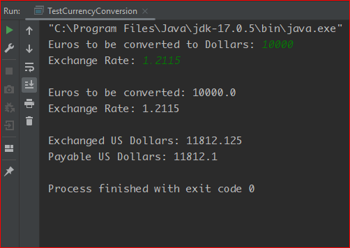

# Assignment 2: CurrencyConversionApp

## Pseudo Code:
    
    -------------------------------------------------------------
    Class CurrencyConversion
    -------------------------------------------------------------
    
    private double amountInUSD;
    
    /* This method will return the converted USD in double type. */
    
    double convertEURToUSD() {
	    final EXCHANGE_FEE = 0.025;		// Exchange fee is constant --> 2.5%
	    amountInUSD = (amountInEUR - (amountInEUR * EXCHANGE_FEE)) * exchangeRate;
	    return amountInUSD;
    }
   
    /* This method will format the USD amout into the nearest rounded decimal format using an object of 
    the DecimalFormat class and using the .format() method. After that it'll return the formated output in String type. */
    
    String calculatePayable() {
	    DecimalFormat decimalFormat = new DecimalFormat("###.#");
	    String payableInUSD = decimalFormat.format(amountInUSD);
	    return payableInUSD;
    }
    
    
    -------------------------------------------------------------
    Class TestCurrencyConversion
    -------------------------------------------------------------
    
    Inside the main() method:
    	1) Create an object of the CurrencyConversion class
	2) Create an object of the Scanner class for taking the inputs
	3) Prompt for Input(s):
		* The amount in EUR that needs to be converted
		* Daily exchange rate
	4) Display Output(s):
		* Euros to be coverted [using the input from the user]
		* Exchange rate [using the input from the user]
		* Exchanged USD [using convertEURToUSD() method of the CurrencyConversion class]
		* Payable USD [using calculatePayable() method of the CurrencyConversion class]
	5) END of the program
	
	

## Output:

